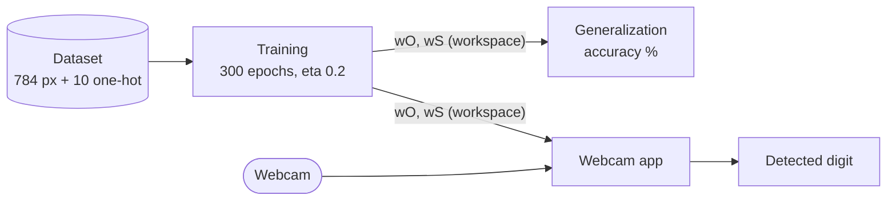
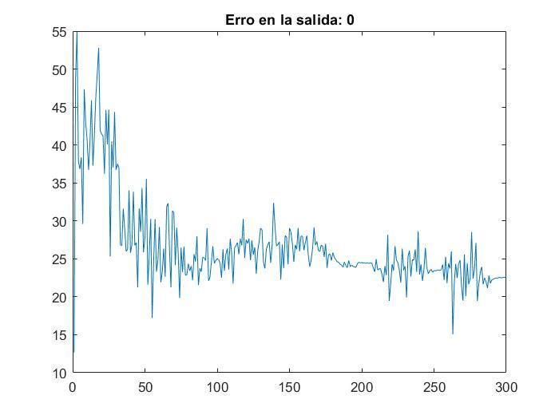
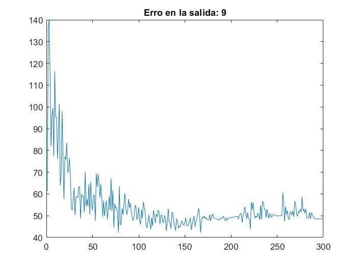

# NumberDetection-AI — Handwritten Digit Recognition with a Hand-Built MLP (MATLAB)

A multilayer perceptron implemented from scratch in MATLAB, trained on MNIST-style
28×28 digit images and used to recognize handwritten digits from a live webcam feed.
University coursework from April 2020.

> **Original implementation.** This repository preserves the original implementation of
> the project. The source code has intentionally not been refactored or modernized in
> order to retain the historical context and original development approach. The source
> code represents the original implementation developed during my university studies.

## Project Overview

The project has three stages, each implemented as a MATLAB script:

1. **Training** — a 784–50–10 MLP (tanh hidden layer, sigmoid output layer) is trained
   with online backpropagation on 40,000 labelled digit images.
2. **Generalization** — the trained network is evaluated on the remaining samples.
   The report gives **92.55 % accuracy** for the best configuration.
3. **Online application** — webcam frames are binarized, resized to 28×28, flattened and
   classified in real time; the detected digit is printed as a Spanish word
   (`CERO` … `NUEVE`).

No neural-network toolbox is used: forward pass, backpropagation and weight updates
are written out by hand.

## Project Context

**Academic / University Project — Coursework / Assignment** (confirmed by the original report)

| | |
|---|---|
| University | Universidad de Guadalajara — CUCEI |
| Course | *Sistemas Inteligentes* (Smart Systems) |
| Activity | *Actividad 5 — Reconocimiento de números* (Number recognition) |
| Author | Omar Baruch Morón López (robotics student) |
| Date | 6 April 2020 (report); uploaded to GitHub in February 2021 |

Full details: [docs/project-context.md](docs/project-context.md).

## Problem Statement

Recognize handwritten digits shown to a computer's webcam, even though handwritten
digits are not standardized in shape, size or stroke.

## Objective

Implement an MLP with backpropagation, train it on a digit dataset, measure its
accuracy on held-out data, and use it in a live webcam application that tells which
digit is being shown.

## Repository Structure

```text
.
├── README.md
├── AGENTS.md                         # Rules for contributors and coding agents
├── LICENSE                           # MIT
├── src/                              # Original MATLAB code (unchanged)
│   ├── MLP_Entrenamiento_DeteccionDeNumeros.m   # 1. Training
│   ├── MLP_Generalizacion_DeteccionDeNumeros.m  # 2. Generalization / accuracy
│   └── MLP_Aplicacion_DeteccionDeNumeros.m      # 3. Live webcam application
└── docs/
    ├── project-context.md            # Origin, course, timeline
    ├── report.md                     # English summary of the original report
    ├── code-overview.md              # Script-by-script walkthrough
    ├── architecture.md               # Workflow and model diagrams
    ├── possible-improvements.md      # Ideas NOT applied to the code
    ├── sdlc/
    │   ├── intent.md                 # Why (retrospective)
    │   ├── spec.md                   # What (as-built specification)
    │   └── plan.md                   # How (as-built plan + preservation plan)
    ├── assets/training-error/        # Figures extracted from the report
    └── original/
        └── MLP_DeteccionDeNumeros_OmarBaruchMoronLopez.pdf  # Original report (Spanish)
```

## Original Implementation

The three scripts in [`src/`](src/) are byte-for-byte identical to the files uploaded in
2021, and their contents match the code annexes of the original report. They were only
moved into `src/`. Spanish identifiers, comments, typos and design decisions are
preserved on purpose. Checksums for verification are listed in
[docs/sdlc/plan.md](docs/sdlc/plan.md#b3-verification).

## Technologies

- **MATLAB** (scripts with local functions; R2016b or newer is inferred from the syntax used)
- **Image Acquisition Toolbox** — `imaqhwinfo`, `videoinput`, `preview`, `getsnapshot`
- **Image processing functions** — `rgb2gray`, `imresize`, `imshow`
- **MNIST-style digit dataset** (per the report) stored as a delimited text file

## How It Works



- **Model:** 784 inputs + bias → 50 `tanh` neurons + bias → 10 sigmoid outputs (one per digit).
- **Training:** per-sample gradient descent, learning rate 0.2, 300 epochs, initial
  weights `rand*0.001`. One error-per-epoch plot is drawn for each output neuron.
- **Evaluation:** a test sample counts as correct only if all 10 rounded outputs match
  the one-hot label.
- **Webcam pre-processing:** grayscale → fixed threshold at 100 (dark ink becomes white,
  paper becomes black, like MNIST) → resize to 28×28 → scale to [0, 1] → row-major flatten.

More detail: [docs/code-overview.md](docs/code-overview.md) and
[docs/architecture.md](docs/architecture.md).

## Inputs and Outputs

| Stage | Input | Output |
|---|---|---|
| Training | `entrenamientoTodo.txt` (rows 1–40,000) | `wO`, `wS` in the workspace; 10 error figures |
| Generalization | `data`, `wO`, `wS` from the workspace (rows 40,001–end) | Accuracy % printed to the console |
| Application | Webcam frames + `wO`, `wS` | Processed 28×28 preview; digit name printed to the console |

The dataset file `entrenamientoTodo.txt` and trained weights are **not included** in the
repository. Its expected layout is described in
[docs/code-overview.md](docs/code-overview.md#dataset-format-expected-by-the-code).

## Running the Project

Derived from the code; the original repository does not include run instructions or
version information.

1. Obtain a digit dataset and save it as `entrenamientoTodo.txt` (one sample per row:
   784 pixel values followed by 10 one-hot label columns) in MATLAB's current folder.
2. Add `src/` to the MATLAB path (or make it the current folder).
3. Run, **in the same MATLAB session**:
   1. `MLP_Entrenamiento_DeteccionDeNumeros` — training (slow: 300 epochs × 40,000 samples);
   2. `MLP_Generalizacion_DeteccionDeNumeros` — prints the accuracy;
   3. `MLP_Aplicacion_DeteccionDeNumeros` — requires a webcam and the Image Acquisition
      Toolbox with a camera adaptor installed.

The scripts pass data through workspace variables, so skipping step 3.1 in a new session
will fail.

## Results

Best configuration reported: 50 hidden neurons, 300 iterations, learning rate 0.2,
initial weights scaled by 0.001, tanh + sigmoid → **92.55 %** accuracy.

<p align="center">
  
  
</p>

A demonstration video is linked in the report: <https://youtu.be/ikjpB5z8S34>.
All figures and observations: [docs/report.md](docs/report.md).

## Documentation

| Document | Description |
|---|---|
| [Project context](docs/project-context.md) | Origin, course, timeline, scope |
| [Report summary](docs/report.md) | English summary of the original report, results, figures, inconsistencies |
| [Code overview](docs/code-overview.md) | What each script does, dataset format, dependencies |
| [Architecture](docs/architecture.md) | Workflow, model and inference pipeline diagrams |
| [Possible improvements](docs/possible-improvements.md) | Known issues and ideas, deliberately not applied |
| [Intent](docs/sdlc/intent.md) · [Spec](docs/sdlc/spec.md) · [Plan](docs/sdlc/plan.md) | Retrospective SDLC artifacts |
| [Original report (PDF, Spanish)](docs/original/MLP_DeteccionDeNumeros_OmarBaruchMoronLopez.pdf) | Submitted deliverable |

## Historical Note

This repository was later reorganized and documented to improve readability and
preserve the historical context of the original project. The original source code
remains unchanged.

## License

[MIT](LICENSE) © 2021 Baruch Lopez
