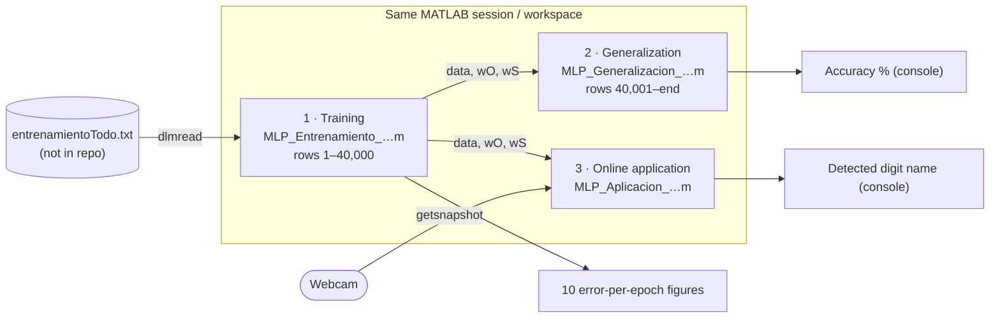
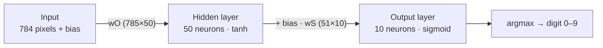

# Architecture

The project is small: three MATLAB scripts that form a sequential workflow and share
state through the **MATLAB workspace** rather than through files or functions. There
are no modules, packages, services or persisted models.

## Workflow

- **Training** is the only stage that reads from disk and the only one that creates
  the weights `wO` and `wS`.
- **Generalization** depends on `data`, `wO` and `wS` already being in the workspace.
- **Application** explicitly clears every variable except `wS`, `wO` and `data`, so it
  also depends on a previous training run in the same session.

## Model structure

## Online inference pipeline

## Architectural characteristics (as implemented)

| Aspect | Observation |
|---|---|
| Coupling | Scripts are coupled through implicit workspace variables (`data`, `wO`, `wS`). |
| Duplication | The forward pass is written out in each of the three scripts. |
| Persistence | None; weights live only in memory for the duration of the session. |
| Configuration | Hyperparameters and sizes are literals inside the scripts. |
| Entry points | Each script is run manually from the MATLAB environment. |

These characteristics are recorded here to explain the original design; possible
alternatives are listed separately in [possible improvements](possible-improvements.md).
