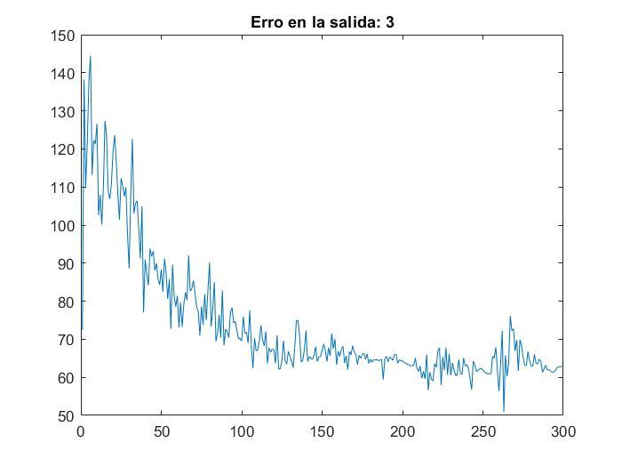

# Report Summary — *Actividad 5: Reconocimiento de números*

English summary of the original report
[`original/MLP_DeteccionDeNumeros_OmarBaruchMoronLopez.pdf`](original/MLP_DeteccionDeNumeros_OmarBaruchMoronLopez.pdf)
(11 pages, Spanish, dated 6 April 2020). The PDF was reviewed both through text
extraction and page-by-page visual inspection (cover, figures and code listings).
This is a structured summary, not a literal translation.

## Document structure

| Pages | Content |
|---|---|
| 1 | Cover page: University of Guadalajara / CUCEI, course *Sistemas Inteligentes*, instructor, *Actividad 5*, author |
| 2 | Objectives (*Objetivos*) and development (*Desarrollo*) |
| 3–7 | Results (*Resultados*): best configuration and nine training-error plots |
| 8 | Analysis and conclusion, YouTube link, start of Annex 1 |
| 8–9 | Annex 1 — training code |
| 9 | Annex 2 — generalization code |
| 9–11 | Annex "4" — online webcam application code |

Every page carries a header with the University of Guadalajara and CUCEI logos, the
author's name, "Smart Systems" and the date.

## Objectives

Identify numbers through the computer's webcam and report which digit is shown,
taking into account the difficulty of non-standardized handwritten digits.

## Development (method described in the report)

1. **Implement the MLP** for *n* inputs, *m* hidden neurons and *l* output neurons.
2. **Obtain the dataset.** The report says the "MNIST" database was downloaded from
   the internet and that it contains **50,000 training samples** of digits 0–9 at
   **28×28 pixels**.
3. **Train (Annex 1).** Each image is used as a 784×1 column (one row per pixel, one
   pixel per network input). Training uses **40,000 of the 50,000** samples; the
   hidden-layer and output-layer weights are then kept.
4. **Generalize (Annex 2).** The remaining samples (written as "10,00" in the report,
   i.e. 10,000) are fed through the network and compared against the known label to
   obtain an overall accuracy percentage.
5. **Online application (Annex referenced as [3], titled Annex 4).** The webcam is
   activated, snapshots are taken, each image is prepared and reduced to 28×28,
   flattened into a single column and passed through the trained network; the result
   is the detected digit.

## Results

The best-performing training reached **92.55 % accuracy** with:

| Parameter | Value in report | Corresponding code |
|---|---|---|
| Hidden neurons | 50 | `nO=50` |
| Iterations (epochs) | 300 ("interacciones") | `for i=1:300` |
| Learning rate | 0.2 (written as "Inteligencia del 0.2") | `eta=.2` |
| Initial weights | "between the values of 0.001" | `rand(...)*.001` → uniform in [0, 0.001) |
| Hidden activation | tanh | `tanh(vO)` |
| Output activation | sigmoid | `sigmoide(vS)` |

### Training-error plots

The report includes one plot per output neuron titled *"Erro en la salida: N"*
("Error at output N"), with the epoch (0–300) on the x-axis and the accumulated error
per epoch on the y-axis. The figures were extracted unchanged into
[`assets/training-error/`](assets/training-error/).

| Output (digit) | Visual observation (approximate, read from the plot) |
|---|---|
| [0](assets/training-error/output-0.jpg) | Starts around 45–55, settles around 22–25 |
| 1 | **Not present in the report** |
| [2](assets/training-error/output-2.jpg) | Starts around 60–70, settles around 20–22 |
| [3](assets/training-error/output-3.jpg) | Starts around 110–145, settles around 60–65 (highest residual error) |
| [4](assets/training-error/output-4.jpg) | Starts around 60–78, settles around 20–25 |
| [5](assets/training-error/output-5.jpg) | Starts around 60–78, settles around 30–32 |
| [6](assets/training-error/output-6.jpg) | Briefly negative at the start, settles around 12–15 |
| [7](assets/training-error/output-7.jpg) | Starts around 30–60, settles around 23–25 |
| [8](assets/training-error/output-8.jpg) | Briefly negative at the start, settles around 32–35 |
| [9](assets/training-error/output-9.jpg) | Starts around 100–140, settles around 48–50 |

All curves decrease quickly during the first ~100 epochs and then plateau with noise.
Negative values are possible because the plotted quantity is the **signed** sum of
errors, not a squared error (see [code overview](code-overview.md#training-script)).

  
  

## Analysis and conclusion

- **Standardization matters.** The author ran into problems converting an *n×m* image
  into an *n×1* vector because MATLAB's built-in functions do not order the elements as
  expected by default (MATLAB is column-major); a non-default ordering had to be used.
  This is visible in the application code, where `reshape(im,...)` is commented out and
  replaced by `reshape(im',...)`.
- An MLP can be trained with 2-D data (or data of any dimension) as long as it is first
  standardized and organized correctly before feeding the network.
- **Parameter selection matters** for any neural network: learning rate (eta), initial
  weight values, iterations and number of hidden neurons.

## External link

- YouTube demonstration of the implementation: <https://youtu.be/ikjpB5z8S34>

## Code annexes

The three code annexes were compared against the scripts in [`src/`](../src/)
(whitespace-normalized text comparison). **They are identical**, which confirms that
the repository contains the same code that was submitted with the report.

| Annex | Script |
|---|---|
| Annex 1 — *Entrenamiento* | [`src/MLP_Entrenamiento_DeteccionDeNumeros.m`](../src/MLP_Entrenamiento_DeteccionDeNumeros.m) |
| Annex 2 — *Generalización* | [`src/MLP_Generalizacion_DeteccionDeNumeros.m`](../src/MLP_Generalizacion_DeteccionDeNumeros.m) |
| Annex 4 — *Aplicación en línea con la cámara web* | [`src/MLP_Aplicacion_DeteccionDeNumeros.m`](../src/MLP_Aplicacion_DeteccionDeNumeros.m) |

## Inconsistencies found in the report

Documented as found; none of them were corrected in the original PDF.

| Item | Observation |
|---|---|
| Annex numbering | The text refers to the application as annex [3], but its heading reads "Anexo 4"; there is no Annex 3. |
| Missing figure | The error plot for output 1 is absent (plots for 0 and 2–9 are present). |
| Test-set size | Written as "10,00"; from context and code (`data(40001:end, ...)`) it is 10,000 if the dataset has 50,000 rows. |
| "Weights are saved" | The report says the weights are saved after training; the code keeps them in the MATLAB workspace only (no `save` call). |
| Dataset name | Written as "MINST"; the context indicates MNIST. The exact source/variant of the 50,000-sample file cannot be confirmed. |
| Wording | "Inteligencia del 0.2" refers to the learning rate; "interacciones" refers to iterations. |
